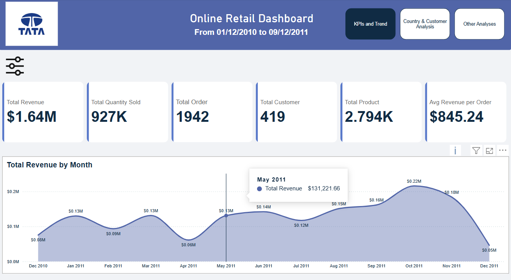
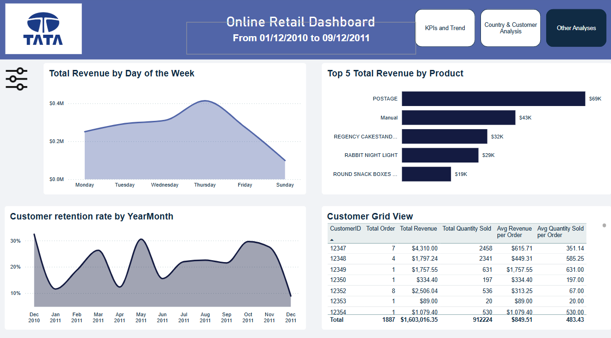
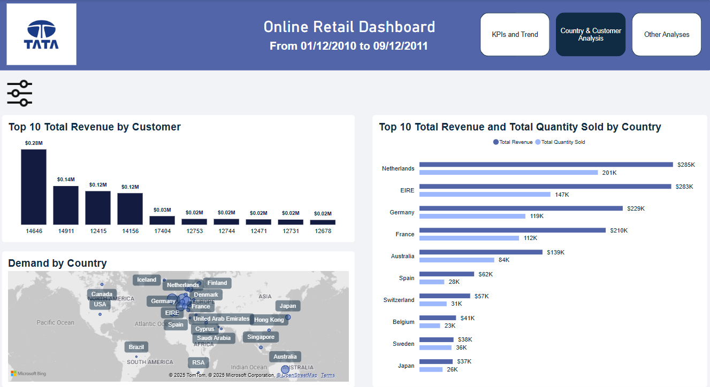

# TataGroupDataVisualisation

**Period:** 01/12/2010 to 09/12/2011  

---

## Key Performance Indicators (KPIs)  
- **Total Revenue:** \$1.64M  
- **Total Quantity Sold:** 927K units  
- **Total Orders:** 1,942  
- **Total Customers:** 419  
- **Total Products:** 2,794  
- **Avg Revenue per Order:** \$845.24  

---

## Revenue Trends  
### Monthly Revenue  
- Revenue peaked at **\$0.25M** (highest observed value).  
- Lowest observed monthly revenue: **\$0.02M**.  

### Revenue by Day of the Week  
- **Highest revenue day:** Thursday (\$0.4M).  
- **Lowest revenue day:** Sunday (\$0.0M).  

---

## Customer Insights  
### Top 10 Customers by Revenue  
1. **Top customer:** Generated **\$0.25M**.  
2. Next 3 customers: **\$0.14M**, **\$0.12M**, **\$0.12M**.  
3. Remaining 6 customers: **\$0.02M** each.  

### Customer Retention Rate  
- **Peak retention:** ~30% (observed in late 2011).  
- **Lowest retention:** ~10% (early 2011).  

---

## Geographic Analysis  
### Top 10 Countries by Revenue & Quantity Sold  
| **Country**     | **Total Revenue** | **Total Quantity Sold** |  
|----------------|------------------|------------------------|  
| Netherlands   | \$285K           | 201K units             |  
| EIRE         | \$263K           | 147K units             |  
| Germany      | \$225K           | 119K units             |  
| France       | \$210K           | 112K units             |  
| Australia    | \$84K            | (Data missing)         |  

---

## Product Performance  
### Top 5 Products by Revenue  
1. **POSTAGE**: \$36K  
2. **REGENCY CAKESTAND...**: \$35K  
3. **RABBIT NIGHT LIGHT**: \$25K  
4. **ROUND SNACK BOXES...**: \$15K  

---

## Customer Behavior  
### Customer Grid View (Sample)  
| **CustomerID** | **Total Orders** | **Total Revenue** | **Avg Revenue/Order** |  
|---------------|------------------|------------------|----------------------|  
| 12347        | 7                | \$4,310          | \$615.71             |  
| 12348        | 4                | \$1,797.24       | \$449.31             |  
| 12349        | 1                | \$1,757.55       | \$1,757.55           |  

---

## Key Observations  
1. **Revenue Concentration:** Top customers and countries drive most revenue (e.g., Netherlands, top customer contributing \$0.25M).  
2. **Retention Fluctuations:** Retention rates improved from 10% to 30% over the year.  
3. **Product Trends:** POSTAGE and decorative items (e.g., CAKESTAND) are top sellers.  
4. **Weekly Pattern:** Sundays show minimal sales, suggesting operational closures or low demand.  

**Recommendations:**  
- Focus on high-value customers/countries for targeted marketing.  
- Investigate Sunday sales dip for potential revenue recovery.  
- Promote top-performing products in underperforming regions.  
